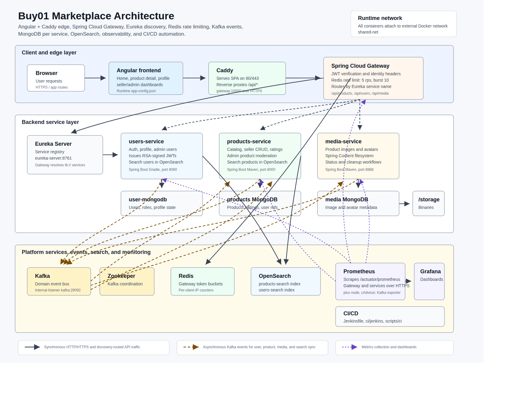

# Buy01 Marketplace

Buy01 Marketplace is a distributed e-commerce platform built around Spring Boot microservices, an Angular frontend, Spring Cloud Gateway, Eureka service discovery, Kafka events, Redis-backed rate limiting, MongoDB per service, OpenSearch search indexes, and Prometheus/Grafana monitoring.

The system is designed so the browser talks to one public edge, while the backend services stay behind the gateway and communicate through service discovery, mTLS, databases, and asynchronous events.



The editable vector source for this diagram is available at `docs/architecture.svg`.

## Architecture At A Glance

| Area | Component | Responsibility |
| --- | --- | --- |
| Web UI | `frontend` | Angular application served by Caddy. Calls `/api/**` and lets Caddy reverse proxy API traffic to the gateway. |
| Edge | `gateway` | Spring Cloud Gateway entry point on port `10000`. Validates JWTs, injects user headers, applies Redis rate limiting, and routes to services through Eureka. |
| Discovery | `eureka-server` | Netflix Eureka registry on port `8761`. Gateway resolves `lb://products`, `lb://users`, and `lb://media` from this registry. |
| Identity | `users-service` | Registration, login, JWT issuing, profile management, admin user management, and user search indexing. |
| Catalog | `products-service` | Product CRUD, seller product management, product ratings, admin product moderation, and product search indexing. |
| Media | `media-service` | Product image and user avatar upload, download, status checks, local filesystem storage, and cleanup workflows. |
| Shared code | `shared` | Common Kafka event names, DTOs, roles, image status, base entities, and API response helpers. |
| Rate limit store | `redis` | Token bucket state for Spring Cloud Gateway rate limiting. |
| Messaging | `kafka` + `zookeeper` | Event bus used to synchronize user, product, media, and search state across services. |
| Search | `opensearch` | Search backend for products and users. Runs as a single-node OpenSearch container. |
| Data stores | MongoDB containers | Each domain service owns its own MongoDB instance and schema. |
| Observability | `prometheus`, `grafana`, `node-exporter`, `cadvisor`, `kafka-exporter` | Metrics scraping, dashboards, host/container metrics, and Kafka metrics. |
| CI/CD | `Jenkinsfile`, `ci/jenkins`, `scripts/ci` | Build, test, deployment, rollback, secrets setup, and notification automation. |

## Request Flow

1. A user opens the Angular application from Caddy.
2. The Angular app calls API paths such as `/api/products`, `/api/users/login`, `/api/media/products/{image}`.
3. Caddy serves static frontend files and reverse proxies `/api/*` to `https://gateway:10000`.
4. Spring Cloud Gateway receives the request.
5. The gateway allows public login/register paths through directly. For other paths, it checks the `Authorization: Bearer ...` JWT when present.
6. If the token is valid, the gateway adds `X-User-Id` and `X-User-Role` headers. If no token is present, it forwards the request with `X-User-Role: GUEST`.
7. Gateway rate limiting checks Redis using the client IP as the key.
8. The gateway routes to the target service using Eureka:
   - `/api/products/**` -> `lb://products`
   - `/api/admin/products/**` -> `lb://products`
   - `/api/users/**` -> `lb://users`
   - `/api/media/**` -> `lb://media` with `stripPrefix(2)`, so `/api/media/products/abc.jpg` becomes `/products/abc.jpg` inside media-service.
9. Backend services authorize the request using trusted gateway headers or service-local security filters, then read/write their own MongoDB database.
10. Domain changes publish Kafka events so other services can update local read models, confirm media usage, delete old media, or update search indexes.

## Service Details

### Frontend

Location: `frontend`

The frontend is an Angular application with pages for home, product detail, seller dashboard, admin dashboard, login, register, and profile. It uses route guards for authenticated and admin-only screens.

In production, the frontend Docker image builds Angular with Node and serves the compiled browser bundle with Caddy. The Caddy configuration:

- serves the SPA from `/usr/share/caddy`;
- rewrites unknown non-API paths to `index.html`;
- reverse proxies `/api/*` to `https://gateway:10000`;
- exposes additional virtual hosts for Jenkins, Grafana, and Prometheus.

Runtime frontend API configuration is written to `app-config.json` from the `API_BASE_URL` environment variable.

### Gateway

Location: `gateway/gateway`

The gateway is the public backend entry point. It uses Spring Cloud Gateway, WebFlux, Eureka Client, reactive Redis, JWT parsing, SSL, Actuator, and Prometheus metrics.

Core responsibilities:

- route API traffic to service names registered in Eureka;
- verify RSA-signed JWTs using the configured public key;
- propagate identity as `X-User-Id` and `X-User-Role`;
- mark anonymous requests as `GUEST`;
- rate limit API route families through Redis;
- use a configured client certificate and truststore when calling downstream HTTPS services;
- expose Actuator Prometheus metrics.

Rate limiting is configured in `GetwayConfig.java` as `RedisRateLimiter(5, 10)`, meaning 5 replenished requests per second with a burst capacity of 10. The key resolver uses the remote client IP.

### Eureka Server

Location: `eureka-server/eureka`

Eureka runs as the service registry. The backend services register themselves with names matching their Spring application names:

- `users`
- `products`
- `media`
- `gateway`

The gateway routes with `lb://...` URIs, so it does not need hard-coded backend host/port mappings for domain services.

### Users Service

Location: `users-service/service`

The users service is a Spring Boot Gradle service responsible for authentication and user data.

Main API families:

- `POST /api/users/register`
- `POST /api/users/login`
- `GET /api/users/me`
- `PUT /api/users/me`
- `DELETE /api/users/me`
- `GET /api/users/search`
- `GET /api/admin/users`
- `PATCH /api/admin/users/{id}/role`
- `DELETE /api/admin/users/{id}`
- `POST /api/admin/users/reindex-search`

It signs JWTs with an RSA private key. The gateway verifies those tokens with the public key. Admin endpoints require `ROLE_ADMIN`. Normal profile endpoints require an authenticated user.

The users service owns `user-mongodb`, publishes user lifecycle events to Kafka, and integrates with OpenSearch for user search.

### Products Service

Location: `products-service/products`

The products service owns product catalog behavior and seller/admin product workflows.

Main API families:

- `GET /api/products/`
- `GET /api/products/page`
- `GET /api/products/search`
- `GET /api/products/category/{category}`
- `GET /api/products/{id}`
- `GET /api/products/{id}/ratings`
- `POST /api/products/{id}/ratings`
- `GET /api/products/me`
- `GET /api/products/me/page`
- `POST /api/products/`
- `PUT /api/products/{id}`
- `DELETE /api/products/{id}`
- `GET /api/admin/products`
- `DELETE /api/admin/products/{id}`
- `POST /api/admin/products/reindex-search`

Public product reads are allowed for `GUEST`, `BUYER`, `SELLER`, and `ADMIN`. Rating requires an authenticated buyer/seller/admin role. Product creation and seller-owned mutations require seller/admin access. Admin product endpoints require `ADMIN`.

The service owns `products-service-mongodb`, consumes user events to maintain product-side user references, publishes product events, publishes image confirmation/deletion events for media-service, and updates the product OpenSearch index.

### Media Service

Location: `media-service/media`

The media service stores product images and user avatars. It uses MongoDB for metadata and Spring Content filesystem storage mounted at `/storage`.

External API paths pass through the gateway as `/api/media/**`, then the gateway strips `/api/media` before forwarding:

- external `POST /api/media/products/` -> internal `POST /products/`
- external `GET /api/media/products/{id}` -> internal `GET /products/{id}`
- external `DELETE /api/media/products/{id}` -> internal `DELETE /products/{id}`
- external `GET /api/media/products/{id}/status` -> internal `GET /products/{id}/status`
- external `POST /api/media/users/` -> internal `POST /users/`
- external `GET /api/media/users/{id}` -> internal `GET /users/{id}`
- external `DELETE /api/media/users/{id}` -> internal `DELETE /users/{id}`
- external `GET /api/media/users/{id}/status` -> internal `GET /users/{id}/status`

GET requests for media are public. Upload and delete operations require authenticated roles. The service consumes user/product lifecycle events and media confirmation/deletion events so unused images and avatars can be cleaned up.

## Data Ownership

Each domain service owns its own database:

| Service | Database/container | Stored data |
| --- | --- | --- |
| users-service | `user-mongodb` | User accounts, roles, profile data, auth-related user state. |
| products-service | `products-service-mongodb` | Products, ratings, product-side user references. |
| media-service | `media-service-mongodb` + `/storage` | Media metadata in MongoDB and binary content on filesystem storage. |

Services do not share a single database. Cross-service consistency is handled through Kafka events and local projections.

## Kafka Event Architecture

Kafka is the asynchronous integration layer. The shared library defines the core event topic names in `EventNames.java`.

| Topic | Producer | Consumers | Purpose |
| --- | --- | --- | --- |
| `create-user-events` | users-service | products-service, media-service | Replicate new user references into services that need user context. |
| `update-user-events` | users-service | products-service | Keep product-side user data aligned with profile/role changes. |
| `remove-user-events` | users-service | products-service, media-service | Remove or cleanup service-local user references and media. |
| `create-product-events` | products-service | media-service | Let media-service know a product now exists. |
| `update-product-events` | products-service | products/search flow | Represent product updates. |
| `remove-product-events` | products-service | media-service | Cleanup product media and metadata when products are removed. |
| `product-search-sync-events` | products-service | products-service search indexer | Synchronize product documents into OpenSearch. |
| `confirm-image-events` | products-service | media-service | Mark product images as confirmed/in use. |
| `delete-image-events` | products-service | media-service | Delete product images no longer referenced. |
| `confirm-avatar-events` | users-service | media-service | Mark a user avatar as confirmed/in use. |
| `delete-avatar-events` | users-service | media-service | Delete a replaced or removed avatar. |

Kafka runs with Zookeeper in `kafka/docker-compose.yaml`. Internal Docker traffic uses `kafka:29092`; host access is exposed on `localhost:9092`.

## Search Architecture

OpenSearch is provided by `opensearch/docker-compose.yaml` as a single-node container on port `9200`.

Products service uses OpenSearch for product search through:

- `ProductSearchDocument`
- `ProductSearchService`
- `ProductSearchEventListener`
- `ProductSearchSyncEvent`

Users service has equivalent user-search code through:

- `UserSearchDocument`
- `UserSearchService`

Admin reindex endpoints are available for rebuilding search indexes when needed:

- `POST /api/admin/products/reindex-search`
- `POST /api/admin/users/reindex-search`

## Security Model

The platform uses layered security:

1. Browser clients authenticate through users-service login.
2. users-service signs JWTs using an RSA private key.
3. Gateway verifies JWT signatures using the RSA public key.
4. Gateway injects identity headers for downstream services.
5. Domain services enforce role-based authorization.
6. Backend service-to-service traffic is HTTPS, with downstream services configured for client certificate authentication.
7. Certificates and truststores are mounted into containers through external Docker volumes.

Certificate generation is automated by `scripts/generate-certs.sh`. The script creates:

- a local CA;
- service certificates for gateway, users-service, media-service, products-service, eureka-server, and prometheus;
- PKCS12 keystores for Spring Boot;
- a shared truststore.

JWT keys are handled separately by `scripts/generate-jwt-keys.sh` and CI secret setup scripts.

## Redis Rate Limiting

Redis is used only by Spring Cloud Gateway for rate limiting.

The gateway defines:

- refill rate: `5` requests per second;
- burst capacity: `10`;
- key: remote client IP address;
- limited routes: products, admin products, users, and media.

Redis does not currently store sessions, product cache, media cache, queues, or pub/sub messages.

## Observability

The project includes Prometheus, Grafana, host/container exporters, and Kafka exporter.

Prometheus scrapes:

- Prometheus itself;
- node-exporter;
- cadvisor;
- kafka-exporter;
- products-service over HTTPS at `/actuator/prometheus`;
- gateway over HTTPS at `/actuator/prometheus`;
- users-service over HTTPS at `/actuator/prometheus`;
- media-service over HTTPS at `/actuator/prometheus`.

The frontend Caddyfile exposes:

- `grafana.bouchikhi.com` -> `grafana:3000`
- `prometheus.bouchikhi.com` -> `prometheus:9090`

## Docker And Runtime Topology

All services join the external Docker network `shared-net`.

Main compose files:

| Compose file | Starts |
| --- | --- |
| `frontend/docker-compose.yml` | Angular/Caddy frontend |
| `eureka-server/docker-compose.yaml` | Eureka server |
| `gateway/docker-compose.yaml` | Spring Cloud Gateway |
| `users-service/docker-compose.yaml` | users-service and user MongoDB |
| `products-service/docker-compose.yaml` | products-service and product MongoDB |
| `media-service/docker-compose.yaml` | media-service, media MongoDB, media storage volume |
| `redis/docker-compose.yaml` | Redis |
| `kafka/docker-compose.yaml` | Zookeeper and Kafka |
| `opensearch/docker-compose.yaml` | OpenSearch |
| `docker-compose.yml` | Monitoring stack |
| `ci/jenkins/docker-compose.yaml` | Jenkins |

Useful ports:

| Component | Port |
| --- | --- |
| frontend/Caddy | `80`, `443` |
| gateway | `10000` |
| eureka-server | `8761` |
| users-service | `8080` |
| products-service | `8000` |
| media-service | `8888` |
| Redis | `6379` |
| Kafka host listener | `9092` |
| Kafka internal listener | `29092` |
| OpenSearch | `9200` |
| Prometheus | `9090` |
| Grafana | host `4002`, container `3000` |

## Running Locally

From the repository root, create the shared Docker network once:

```bash
docker network create shared-net
```

Build/install the shared Java library before backend services that depend on it:

```bash
cd shared
./mvnw clean install
```

Generate mTLS certificates before running the secured backend stack:

```bash
./scripts/generate-certs.sh
```

Copy the generated certificates into Docker volumes. This also prepares the JWT key pair for users-service and gateway when no JWT keys are supplied:

```bash
./scripts/setup-cert-volumes.sh
```

Start the platform:

```bash
cd scripts
./run-all.sh
```

Stop the platform:

```bash
cd scripts
./stop.sh
```

Clean up containers and related resources:

```bash
./scripts/remove-all.sh
```

## Repository Map

```text
.
├── frontend/                 Angular UI and Caddy runtime
├── gateway/                  Spring Cloud Gateway
├── eureka-server/            Eureka service registry
├── users-service/            Authentication, profiles, admin users
├── products-service/         Catalog, ratings, seller/admin products
├── media-service/            Product images and user avatars
├── shared/                   Shared Java DTOs, roles, Kafka names, utilities
├── kafka/                    Kafka and Zookeeper compose
├── redis/                    Redis compose
├── opensearch/               OpenSearch compose
├── prometheus/               Prometheus scrape configuration
├── ci/jenkins/               Jenkins container configuration
├── scripts/                  Local and CI helper scripts
└── docs/                     Additional architecture, deployment, and setup docs
```

## Supporting Documentation

More focused documentation lives in `docs/`, including:

- `docs/TESTING_GUIDE.md`
- `docs/FRONTEND_CONFIGURATION.md`
- `docs/JENKINS_CICD.md`
- `docs/S3_MEDIA_STORAGE_README.md`
- `docs/MTLS_README.md`
- `docs/README-opensearch-product-search.md`
- `docs/AWS_CDN_BUY01_GUIDE.md`
- `docs/EMAIL_SETUP.md`
- `docs/SONARCLOUD_CI.md`
